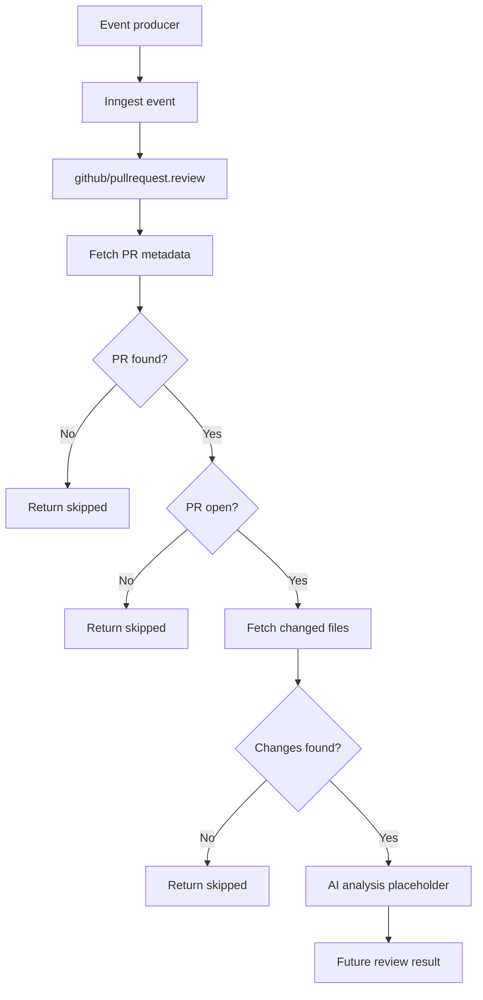

# GitHub PR Review POC

## Overview

This project is a Node.js proof of concept for reviewing GitHub pull requests with an AI agent.

The intended workflow is:

1. An Inngest event identifies a GitHub pull request.
2. The Inngest function fetches pull-request metadata.
3. The function fetches the changed files and patches.
4. An AI agent analyzes the pull request.
5. The review result can eventually be returned or posted to GitHub.

The current implementation completes the data-fetching stages. The AI-analysis stage is currently empty.

## Technology Stack

- Node.js with native ES modules
- Express for the HTTP server
- Inngest for event-driven functions
- Octokit for GitHub API access
- OpenAI Agents SDK for AI review generation
- Zod for structured AI output validation
- dotenv for environment variables
- Prettier for formatting

## Project Structure

```text
github_pr_poc/
├── index.js
├── package.json
├── package-lock.json
├── jsconfig.json
├── agents/
│   └── github-pr-review-agent.js
├── inngest/
│   ├── client.js
│   └── functions/
│       ├── github_review.js
│       └── index.js
└── lib/
    └── github.js
```

## File Responsibilities

### `index.js`

Creates the Express server, loads environment variables, and mounts the Inngest handler.

The Inngest endpoint is:

```text
/api/inngest
```

The application listens on port `3000`:

```text
http://localhost:3000
```

The root route currently returns `Hello World!`.

### `inngest/client.js`

Creates the Inngest client:

```js
export const inngest = new Inngest({
  id: 'github_pr_reviewed',
  name: 'GitHub PR Reviewed',
});
```

### `inngest/functions/index.js`

Exports the Inngest functions that should be served. Currently, it exports only `pullRequestReviewed`.

### `inngest/functions/github_review.js`

Contains the main pull-request review workflow. It listens for this custom event:

```text
github/pullrequest.review
```

The expected event payload is:

```json
{
  "owner": "repository-owner",
  "repo": "repository-name",
  "pull_number": 123
}
```

### `lib/github.js`

Creates an authenticated Octokit client using the `GITHUB_TOKEN` environment variable.

The token must not be committed, logged, or included in documentation.

### `agents/github-pr-review-agent.js`

Defines the AI review agent and its expected structured output. The agent is currently defined but not called by the workflow.

## Runtime Flow



## Pull-Request Workflow

### 1. Fetch pull-request information

The function calls the GitHub API:

```js
octokit.rest.pulls.get({
  owner,
  repo,
  pull_number,
});
```

It extracts these fields:

```js
{
  id,
  title,
  state,
  pull_number,
  comments,
  url,
  diffURL,
  commints,
  changes
}
```

The `commints` property is a typo and should be renamed to `commits`.

If the GitHub request fails, the function currently returns:

```js
{
  message: 'Pull request is not found',
  skipped: true
}
```

This treats all errors as a missing pull request. Authentication errors, rate limits, permission errors, and network failures are not currently distinguished.

### 2. Check pull-request state

Only open pull requests are reviewed. Closed or merged pull requests are skipped:

```js
{
  message: 'Pull request is not open, Skipping the review',
  skipped: true,
  completed: false
}
```

### 3. Fetch changed files

The function uses `octokit.paginate` with GitHub's `pulls.listFiles` endpoint. This allows it to retrieve all changed files across multiple pages.

Each file is reduced to:

```js
{
  fileName,
  changeStatus,
  changes,
  patch,
  addition,
  deletions,
  previous_filename
}
```

These values represent the filename, change status, diff patch, changed-line count, additions, deletions, and previous filename for renamed files.

If no changes are returned, the function skips the review:

```js
{
  message: 'No changes found',
  skipped: true
}
```

### 4. AI analysis

The current code contains an empty step:

```js
await step.run('ai-analysis', async () => {
});
```

This step does not yet:

- Import or call the AI agent.
- Pass pull-request metadata to the agent.
- Pass file patches to the agent.
- Return an AI review.
- Post comments to GitHub.
- Persist the review.
- Return a successful completion response.

## AI Agent

The agent is configured with the name `PR Review Agent` and instructions to act as an expert code reviewer, identify bugs, suggest fixes, and return natural comments.

Its output schema is currently:

```js
z.object({
  criticalFixes: z.array(),
  date: z.string(),
  participants: z.array(z.string()),
});
```

The schema is currently weak because `criticalFixes` does not define the shape of its elements. It also does not include a summary, severity, file, line number, explanation, or recommendation.

A stronger review schema could be:

```js
z.object({
  summary: z.string(),
  riskLevel: z.enum(['low', 'medium', 'high']),
  findings: z.array(
    z.object({
      file: z.string(),
      line: z.number().optional(),
      severity: z.enum(['critical', 'high', 'medium', 'low']),
      title: z.string(),
      explanation: z.string(),
      recommendation: z.string(),
    }),
  ),
  date: z.string(),
  participants: z.array(z.string()),
});
```

## Environment Configuration

The application expects a GitHub token in `.env`:

```env
GITHUB_TOKEN=your_github_token
```

The `.env` file is ignored by Git. A safe `.env.example` file should be added for documentation without including a real token.

If a real token has been exposed, it should be revoked and replaced immediately.

## Running the Project

Install dependencies:

```bash
npm install
```

Start development mode:

```bash
npm run dev
```

Start normally:

```bash
npm start
```

Format files:

```bash
npm run format
```

Check formatting:

```bash
npm run format:check
```

The current test script is only a placeholder and intentionally fails because tests have not been added:

```bash
npm test
```

## Current Implementation Status

### Implemented

- Express server
- Inngest client
- Inngest HTTP endpoint
- Registered pull-request review function
- GitHub authentication through Octokit
- Pull-request metadata retrieval
- Open pull-request filtering
- Changed-file retrieval
- Pagination for changed files
- Basic skipped responses
- AI agent definition
- Zod output schema

### Not implemented

- Automatic GitHub webhook integration
- AI-agent invocation
- Passing patches to the AI agent
- Returning the final AI review
- Posting comments to GitHub
- Review persistence
- Input validation
- Retry and error classification
- GitHub rate-limit handling
- Tests
- Large pull-request chunking or token limits

## Important Design Gaps

1. The AI agent is defined but never imported or executed by the workflow.
2. The fetched `changes` array is not passed to the AI step.
3. The function has no final successful result.
4. `github/pullrequest.review` is a custom Inngest event; GitHub does not emit it automatically.
5. Event data is not validated before use.
6. All GitHub API failures are treated as missing pull requests.
7. Large diffs may exceed the AI model's input limits.
8. Files without patches, such as binary files, need special handling.
9. There are no tests.

## Recommended Next Steps

1. Validate `owner`, `repo`, and `pull_number` with Zod.
2. Import and invoke `githubPRreviewAgent` inside the `ai-analysis` step.
3. Pass pull-request metadata and changed-file patches to the agent.
4. Return the structured AI result from the Inngest function.
5. Add size limits or chunking for large pull requests.
6. Add GitHub review-comment publishing if desired.
7. Add tests for missing, closed, empty, and successfully reviewed pull requests.
8. Add `.env.example` without any secret values.

## Summary

This project is currently a GitHub pull-request data collection pipeline with an AI-review agent scaffolded but not connected. The Express and Inngest infrastructure is in place, and GitHub metadata and file changes can be fetched. The main remaining work is to connect the fetched data to the AI agent, return the review, and optionally publish that review back to GitHub.
